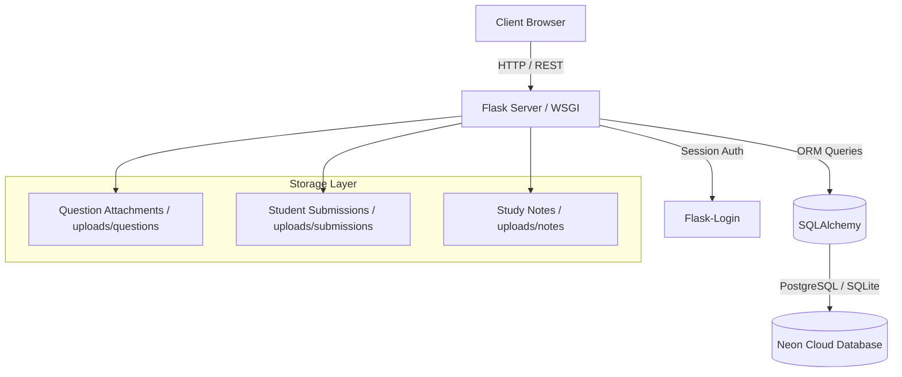
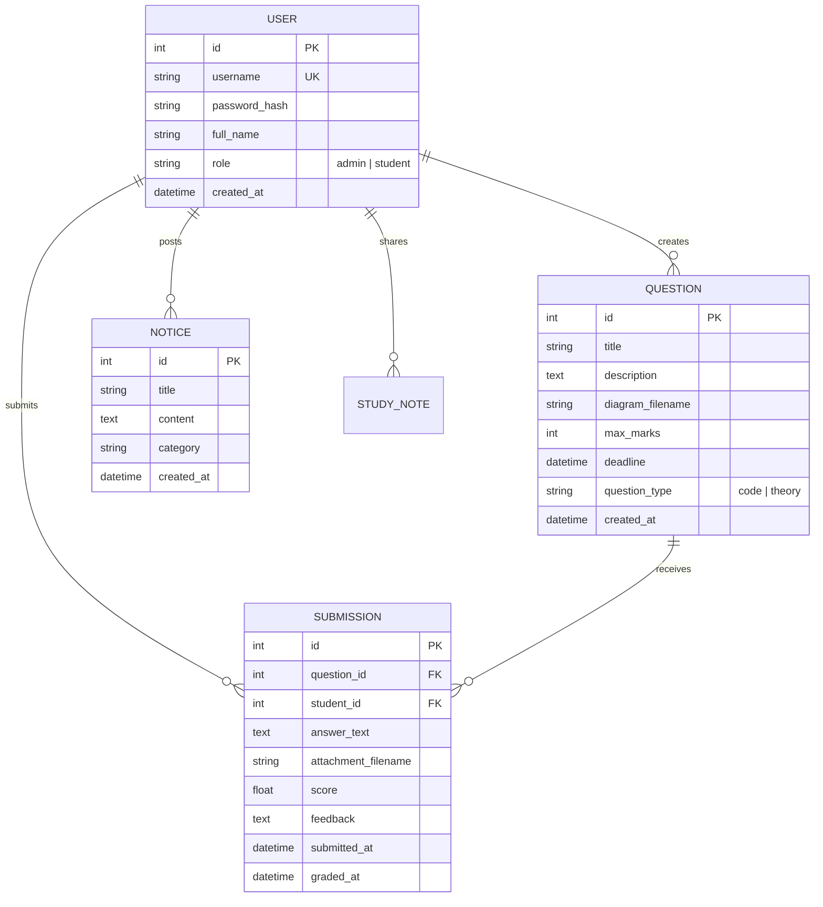

<div align="center">

# ⚡ DSA LEARNER
### *Enterprise-Grade Data Structures & Algorithms Evaluation Platform*

[](https://python.org)
[](https://flask.palletsprojects.com/)
[](https://neon.tech)
[](https://vercel.com)
[](https://github.com/themaheshbuilds)
[](#license)

[Features](#-key-features) • [System Architecture](#-system-architecture) • [Quick Start](#-quick-start) • [Workflow](#-platform-workflows) • [Deployment](#-deployment-guide)

---

</div>

## 📌 Executive Overview

**DSA Learner** is a modern, full-stack web application designed for academic institutions, coding bootcamps, and DSA educators to manage, evaluate, and grade computer science assignments. 

Featuring **interactive diagram attachments**, **automated deadline locks**, **split-screen evaluation workspaces**, **custom preset feedback chips**, and **CSV grade exports**, DSA Learner streamlines the entire assignment lifecycle from question creation to final score distribution.

---

## ✨ Key Features

<div align="center">

| Feature | Description | Target Audience |
| :--- | :--- | :---: |
| 🔒 **Controlled User Directory** | Admin-provisioned accounts with self-service password reset controls | Admin / Student |
| 📝 **Diagram Question Bank** | Create code & theory problems with high-res diagram attachments | Admin / Faculty |
| ✍️ **Dual Submission Format** | Submit text/code solutions with multi-diagram attachment uploads | Student |
| ⭐ **Split-Screen Evaluator** | Side-by-side submission review with preset grading chips & instant feedback | Admin / Grader |
| 📢 **Notice Board Hub** | Categorized notice announcements with urgency tags & rich formatting | Everyone |
| ⏰ **Smart Deadline Engine** | Automatic lockouts when submission windows expire | System |
| 📊 **Analytics & Export** | One-click CSV grade book exports & score distributions | Admin |
| 🎨 **Prism Syntax Engine** | Built-in dark mode syntax highlighting for multi-language code blocks | Everyone |

</div>

---

## 🏗️ System Architecture



---

## 💡 Platform Workflows

### 🛡️ Admin & Educator Portal
1. **Student Provisioning**: Create and manage student user accounts, initialize credentials, and execute password resets.
2. **Assignment Authoring**: Publish coding tasks or theoretical DSA questions with maximum marks, cut-off deadlines, and attached reference diagrams.
3. **Interactive Grading Workspace**: View student solutions alongside reference diagrams, apply instant comment chips, assign partial/full points, and return graded feedback.
4. **Export & Reporting**: Generate consolidated `.csv` grade books for offline records.

### 🎓 Student Workspace
1. **Personal Dashboard**: Track active assignments, pending deadlines, notice boards, and overall performance scores.
2. **Interactive Code Editor**: Write and test algorithms with syntax highlighting.
3. **Diagram Attachment Upload**: Upload handwritten code scans, whiteboard diagrams, or flowchart images with submissions.
4. **Feedback Review**: Inspect instructor grade breakdowns, inline comments, and suggestions.

---

## 🗄️ Database Entity-Relationship Model



---

## 🚀 Quick Start

> [!IMPORTANT]
> Requires **Python 3.9+** and `pip` installed on your environment.

### 1. Clone & Set Up Directory
```bash
git clone https://github.com/themaheshbuilds/dsa-learner.git
cd dsa-learner
```

### 2. Configure Virtual Environment

#### Windows (PowerShell)
```powershell
python -m venv .venv
.\.venv\Scripts\Activate.ps1
pip install -r requirements.txt
```

#### macOS / Linux
```bash
python3 -m venv .venv
source .venv/bin/activate
pip install -r requirements.txt
```

### 3. Initialize Database & Seed Admins
```bash
python seed_admin.py
```

> [!TIP]
> **Default Seed Credentials:**
> - **Primary Admin**: Username: `mahesh` | Password: `12341234`
> - **Secondary Admin**: Username: `admin` | Password: `admin123`

### 4. Launch Application
```bash
python app.py
```
Visit **`http://127.0.0.1:5000`** in your web browser.

---

## 🛠️ Tech Stack & Dependencies

- **Core Backend Framework**: [Flask 3.0.2](https://flask.palletsprojects.com/)
- **Database & ORM**: [Flask-SQLAlchemy](https://flask-sqlalchemy.palletsprojects.com/) + [PostgreSQL (Neon.tech)](https://neon.tech) / [SQLite](https://sqlite.org)
- **Authentication**: [Flask-Login](https://flask-login.readthedocs.io/) + [Werkzeug Security](https://werkzeug.palletsprojects.com/)
- **Frontend & Styling**: HTML5, Vanilla CSS3, Bootstrap 5, Prism.js Syntax Highlighting
- **Deployment Platform**: [Vercel Serverless](https://vercel.com/) (WSGI Engine via `vercel.json`)

---

## 📁 Repository Structure

```gcode
dsa-learner/
├── 📄 app.py                  # Flask main Application Entry point & API routes
├── 📄 config.py               # Environment configuration & Database URLs
├── 📄 database.py             # SQLAlchemy instance initialization
├── 📄 models.py               # Database schemas (User, Question, Submission, Notice)
├── 📄 seed_admin.py           # Admin user initialization script
├── 📄 migrate_db.py           # Database migration helper
├── 📄 requirements.txt        # Python package dependencies
├── 📄 vercel.json             # Vercel serverless configuration
├── 📄 test_app.py             # Automated unit & integration tests
├── 📁 static/                 # Static CSS, JavaScript, and asset libraries
│   ├── 📁 css/                # Custom stylesheets & themes
│   └── 📁 js/                 # Client-side validation & UI interactions
└── 📁 templates/              # Jinja2 HTML templates
    ├── 📄 base.html           # Universal layout template
    ├── 📄 index.html          # Dashboard home page
    ├── 📄 login.html          # Authentication portal
    ├── 📄 admin_dashboard.html# Evaluation & grading dashboard
    └── 📄 student_view.html   # Student assignment hub
```

---

## 🌐 Deployment Guide (Vercel + Neon PostgreSQL)

1. **Create Neon Database**: Sign up at [Neon.tech](https://neon.tech) and create a PostgreSQL instance. Copy the connection string (`postgresql://...`).
2. **Connect to Vercel**: Import your `dsa-learner` GitHub repository into Vercel.
3. **Environment Variables**: Add the following variables under Vercel Settings:
   - `DATABASE_URL` = `your_neon_postgresql_connection_string`
   - `SECRET_KEY` = `your_secure_random_key`
4. **Deploy**: Trigger a Vercel build. The `vercel.json` file automatically routes WSGI requests to `app.py`.

---

## 🛡️ Security Features

> [!NOTE]
> - **Password Hashing**: PBKDF2 with SHA256 password hashing via Werkzeug.
> - **CSRF & Session Security**: HTTP-only session cookies with configurable secret keys.
> - **Access Control**: Role-based routing decorators (`@admin_required`) enforcing authorization boundaries across endpoints.
> - **File Upload Sanitization**: Filename truncation and sanitization using `secure_filename`.

---

## 📜 License & Author

Distributed under the **MIT License**. See `LICENSE` for more information.

<div align="center">

---
### 👨‍💻 Architected & Engineered by **Mahesh Vilasagaram**
*AI-First Full-Stack Software Engineer*

[](https://github.com/themaheshbuilds)
[](https://www.linkedin.com/in/mahesh-vilasagaram)
[](mailto:vilasagarammahesh90@gmail.com)

</div>
